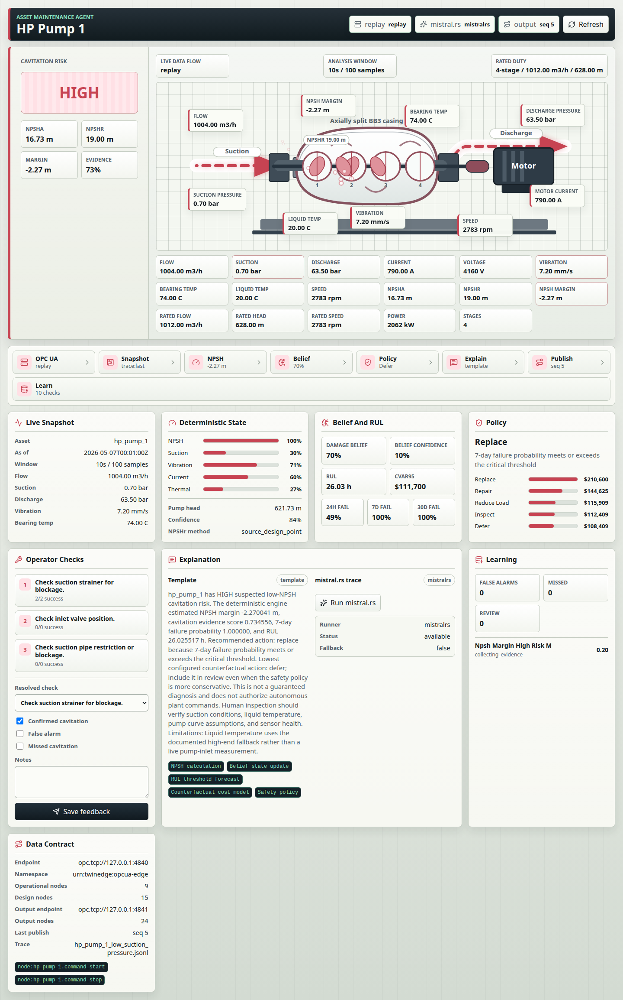

# AssetPilot

> **Deterministic self-improving maintenance agent for industrial assets.**

AssetPilot is a Rust-native deterministic maintenance-agent demo for asset
health reasoning, replayable decisions, human feedback, local explanations, and
an operator-facing dashboard.



The first demo asset is `hp_pump_1`, a synthetic high-pressure pump profile
focused on low-NPSH cavitation risk. The architecture is intentionally small:
Rust for deterministic runtime paths, TypeScript for the dashboard, and Python
only for tooling.

Developed with assistance from Codex and Claude.

## Determinism Contract

AssetPilot's safety-relevant path is deterministic and auditable. Given the
same input snapshot, configuration, asset model, and recorded feedback state,
the Rust core produces the same risk level, derived features, belief/RUL
summary, policy recommendation, checklist, and OPC UA output values.

The optional `mistral.rs` layer is explanation-only. It never owns the risk
decision, policy action, thresholds, or output nodes. LLM text is guard-checked
before display, and the deterministic Rust result remains the source of truth.

## Stack

- Rust deterministic engine, API, SQLite memory, and OPC UA I/O
- Optional local `mistral.rs` explanation layer with guard checks
- TypeScript/Next.js dashboard
- Python tooling for source-bundle checks

## Related Repository

Live OPC UA telemetry for the demo can be provided by
[`twinedge-ai/opcua-edge`](https://github.com/twinedge-ai/opcua-edge), a
plain-C OPC UA edge server for industrial telemetry. AssetPilot treats it as an
optional sibling checkout, not a vendored dependency.

Recommended local layout:

```text
projects/
  opcua-edge/
  deterministic-asset-maintenance-agent/
```

In that layout, `./scripts/run_phase9_verification.sh` can find `opcua-edge`
through its default sibling path. Use `OPCUA_EDGE_ROOT=/path/to/opcua-edge` for
any other location.

## Quick Start

Prerequisites:

- Rust `1.95`
- Node.js `>=20.9`
- npm `>=10`
- `jq` for smoke scripts

Run the API:

```bash
cargo test
cargo run -p asset-agent-api
```

Open API health:

```bash
curl http://127.0.0.1:8080/
curl http://127.0.0.1:8080/api/health
```

Run the dashboard:

```bash
cd frontend
npm ci
npm run dev
```

Open:

```text
http://127.0.0.1:3000
```

The browser talks to the Next.js dashboard. The dashboard proxies
`/api/asset-agent/*` to the Rust API from the Next.js server, so the browser
does not need a separate API port.

## Local mistral.rs Setup

The GGUF model is a large local runtime artifact and is not committed to git.
`models/mistral/*.gguf` is ignored by `.gitignore`.

Install the runner and download the pinned model:

```bash
./scripts/setup_mistralrs.sh
```

The script installs `mistralrs-cli` if needed, downloads
`mistral-7b-instruct-v0.2.Q4_K_M.gguf` to `models/mistral/model.gguf`, and
verifies:

```text
sha256 = 3e0039fd0273fcbebb49228943b17831aadd55cbcbf56f0af00499be2040ccf9
```

Run the no-fallback LLM smoke:

```bash
./scripts/run_mistral_llm_smoke.sh
```

Expected LLM fields:

```json
{
  "source": "mistralrs",
  "fallback_used": false,
  "guard_passed": true
}
```

Enable the API LLM path manually:

```bash
ASSET_AGENT_LLM_ENABLED=1 \
MISTRALRS_TIMEOUT_MS=180000 \
cargo run -p asset-agent-api
```

## Security

The default runtime is localhost-only. Do not expose the API, dashboard proxy,
or OPC UA endpoints to an untrusted network without authentication, network
controls, and a plant-specific security review.

If you bind the API to a non-loopback address, set an API token:

```bash
ASSET_AGENT_API_ADDR=0.0.0.0:8080 \
ASSET_AGENT_API_TOKEN="$(openssl rand -hex 32)" \
cargo run -p asset-agent-api
```

When the dashboard proxies to a token-protected API, give the same token to the
Next.js server:

```bash
cd frontend
ASSET_AGENT_API_URL=http://127.0.0.1:8080 \
ASSET_AGENT_API_TOKEN="$ASSET_AGENT_API_TOKEN" \
npm run dev
```

Configure browser origins with `ASSET_AGENT_CORS_ORIGINS`. The OPC UA sample
output endpoint uses anonymous/no-security mode for local interoperability
testing only.

## Data Policy

The public `hp_pump_1` profile is synthetic and exists to exercise the software.
This repository does not redistribute vendor manuals, vendor HTML captures,
plant records, or model weights. Replace the demo profile with authorized
asset data before operational use.

Create release archives from git, not by zipping a working directory, so ignored
local artifacts like `target/`, `frontend/node_modules/`,
`frontend/.next/`, SQLite databases, generated traces, and
`models/mistral/model.gguf` stay out of the release.

## Verification

Run the release checks:

```bash
cargo fmt --check
cargo clippy --workspace --all-targets -- -D warnings
cargo test -q
python3 tools/python/scripts/source_bundle_check.py

cd frontend
npm ci
npm audit --omit=dev --audit-level=moderate
npm run typecheck
npm run build
```

Optional live OPC UA smoke requires a separately installed
[`opcua-edge`](https://github.com/twinedge-ai/opcua-edge) checkout. Set
`OPCUA_EDGE_ROOT` when it is not checked out as a sibling directory:

```bash
OPCUA_EDGE_ROOT=/path/to/opcua-edge ./scripts/run_phase9_verification.sh
```

## License

MIT. See [LICENSE](LICENSE).
